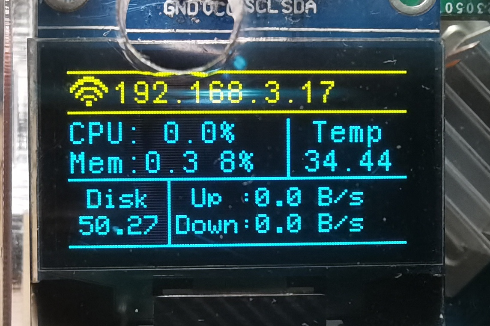

# 实时设备信息显示（OrangePi Zero3版本）



## 简介

基于OrangePi Zero3开发的实时设备信息显示系统。通过SSD1306 OLED屏幕显示设备的实时状态信息。

**显示的信息包括：**
- **网络连接状态**（WIFI/LAN图标）
- **IP地址**（WLAN/LAN）
- **CPU使用率**（CPU%）
- **内存使用情况**（Mem: MB %）
- **CPU温度**（Temp: °C）
- **磁盘剩余容量**（Disk: GB）
- **网络速度**（Up/Down: B/s, KB/s, MB/s, GB/s）

## 硬件要求

1. **OrangePi Zero3** 开发板（或其他Linux开发板）
   - 需要安装 wiringOP（香橙派）或 wiringPi（树莓派）

2. **SSD1306 OLED屏幕** 
   - 分辨率：128×64 像素
   - 通信方式：四线I2C
   - 推荐使用 0.96 英寸屏幕

3. **连接线材**
   - 杜邦线若干，或使用本仓库提供的转接板（Hardware目录下）

## 快速开始

### 1. 检查I2C设备

查看I2C外设位置：

```bash
user@orangepizero3:~$ gpio readall
```

### 2. 连接OLED屏幕

**接线方式（以I2C.3为例）：**

| OLED | 香橙派Zero3 |
|------|-----------|
| VCC  | 3.3V      |
| GND  | GND       |
| SDA  | SDA.3 (GPIO229) |
| SCL  | SCL.3 (GPIO228) |

### 3. 验证I2C连接

安装I2C工具：

```bash
sudo apt-get update
sudo apt-get install -y i2c-tools
```

检测I2C设备：

```bash
user@orangepizero3:~$ sudo i2cdetect -y 3
     0  1  2  3  4  5  6  7  8  9  a  b  c  d  e  f
00:                         -- -- -- -- -- -- -- --
10: -- -- -- -- -- -- -- -- -- -- -- -- -- -- -- --
20: -- -- -- -- -- -- -- -- -- -- -- -- -- -- -- --
30: -- -- -- -- -- -- -- -- -- -- -- -- 3c -- -- --
40: -- -- -- -- -- -- -- -- -- -- -- -- -- -- -- --
50: -- -- -- -- -- -- -- -- -- -- -- -- -- -- -- --
60: -- -- -- -- -- -- -- -- -- -- -- -- -- -- -- --
70: -- -- -- -- -- --
```

如果看到 `3c`，说明OLED连接正常。

### 4. 克隆仓库

```bash
git clone https://github.com/Zhe-SH-CN/OPiZero3_RTDevInfo.git
cd OPiZero3_RTDevInfo
```

### 5. 配置参数

编辑配置文件：

```bash
vim Software/inc/UserCfg.h
```

**主要配置项：**

```c
/*无线网卡文件名*/
#define WLAN_IF         "wlan0"

/*有线网卡文件名*/
#define ETH_IF          "end0"

/*i2c设备文件名*/
#define LINUX_IIC_FILE  "/dev/i2c-3"

/*刷新时间(s)*/
#define REFRESH_TIME    1

/*网络接口优先级: 0=WLAN优先, 1=LAN优先 (default)*/
#define PREFER_LAN      1

/*是否启用运行时间控制*/
#define ENABLE_RUNNING_PERIOD   0
```

根据实际情况修改 `LINUX_IIC_FILE` 和其他参数。

### 6. 编译

```bash
cd Software
make
```

编译成功后会生成 `RTDevInfo` 可执行文件：

```bash
user@orangepizero3:~/OPiZero3_RTDevInfo/Software$ ls
inc  Makefile  obj  RTDevInfo  src
```

### 7. 运行

```bash
sudo ./RTDevInfo
```

屏幕应该会点亮并显示系统信息。如果想跳过启动画面，可以：

```bash
sudo ./RTDevInfo -r
```

## 主要特性

### 已修复的Bug

✅ **内存显示准确** - 使用 `/proc/meminfo` 读取实际可用内存
✅ **磁盘溢出修复** - 数字不再超过屏幕边界
✅ **网络优先级** - 可配置LAN或WLAN优先显示
✅ **适配Debian Bookworm** - 默认使用 `end0` 网卡

### 显示格式说明

- **内存**: `Mem:XXX MB`（实时更新）
- **磁盘**: 
  - `<100GB` 显示2位小数：`50.25 GB`
  - `≥100GB` 显示1位小数：`100.0 GB`
- **温度**: `XX.XX°C`
- **网速**: 自动单位转换 B/s → KB/s → MB/s → GB/s

## 文件结构

```
OPiZero3_RTDevInfo/
├── Software/
│   ├── src/
│   │   ├── main.c           # 主程序（显示逻辑）
│   │   ├── DevInfo.c        # 系统信息获取
│   │   ├── NetTools.c       # 网络工具函数
│   │   ├── SSD1306_IIC.c    # OLED驱动
│   │   └── ...
│   ├── inc/
│   │   ├── UserCfg.h        # 用户配置
│   │   ├── DevInfo.h
│   │   ├── NetTools.h
│   │   ├── SSD1306_IIC.h
│   │   └── ...
│   └── Makefile
├── HardWare/                # 转接板设计（立创EDA）
├── README.md
└── rtdevinfo.jpg           # 效果图
```

## 常见问题

### Q: OLED不显示
A: 检查I2C是否正常连接（使用 `i2cdetect`），确认 `LINUX_IIC_FILE` 配置正确

### Q: 内存显示不变化
A: 确保 `/proc/meminfo` 可读，检查程序权限

### Q: 网络显示错误
A: 检查网卡名称是否正确（`ip link` 查看），根据需要调整 `WLAN_IF` 和 `ETH_IF`

## 致谢

感谢参考的开源项目和社区支持。

## 许可证

MIT License

